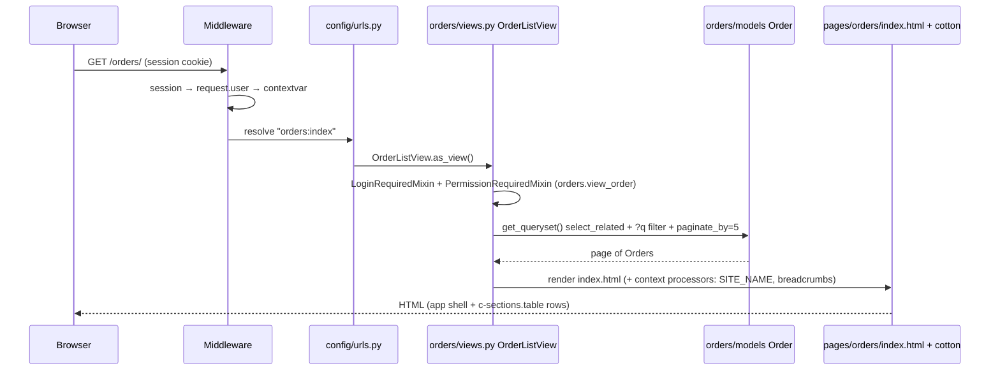

# Request Lifecycle

> How an HTTP request travels through TGC-SYSTEM — from the URL a browser hits, through
> middleware, routing, the view → service → model layers, template rendering, and back out as a
> response. Every step names the **files involved** so you can follow (or debug) any request end to
> end. The last section is a **catalog of every URL** in the system.
>
> Architecture rules referenced here: [`conventions.md`](conventions.md) (§2 layering, §8 views),
> [`modules.md`](modules.md) (the apps), [`permissions.md`](permissions.md) (auth), and the schema
> in [`../database/data-model.md`](../database/data-model.md).

---

## 1. The path at a glance

```
                    ┌─────────────────────────────────────────────────────────────┐
  Browser  ──HTTP──▶│  WSGI (config/wsgi.py)  →  MIDDLEWARE stack (top → bottom)   │
                    └─────────────────────────────────────────────────────────────┘
                                              │
                                              ▼
                    ROOT_URLCONF = config/urls.py  ──includes──▶  apps/<app>/urls.py
                                              │  (namespace:name → view)
                                              ▼
   L4/L3  ┌───────────────────────────────────────────────────────────────────────┐
   VIEW   │  apps/<app>/views.py  (thin: parse request → call one service/selector) │
          │  LoginRequiredMixin / PermissionRequiredMixin guard the entry           │
          └───────────────────────────────────────────────────────────────────────┘
                                              │
                                              ▼
   L3     ┌───────────────────────────────────────────────────────────────────────┐
   SERVICE│  apps/<app>/services.py  (business rules, @transaction.atomic)          │
          └───────────────────────────────────────────────────────────────────────┘
                                              │
                                              ▼
   L1     ┌───────────────────────────────────────────────────────────────────────┐
   MODEL  │  apps/<app>/models/  (BaseModel: soft-delete + audit) → PostgreSQL      │
          └───────────────────────────────────────────────────────────────────────┘
                                              │
                                              ▼
          ┌───────────────────────────────────────────────────────────────────────┐
   RENDER │  render(request, "pages/<app>/<name>.html", ctx)                        │
          │  cotton shell: layouts/app.html → base.html + context processors        │
          └───────────────────────────────────────────────────────────────────────┘
                                              │
                                              ▼
                    Response (HTML + Tailwind CSS + Alpine/HTMX)  ──▶  Browser
```

Two rules make this predictable:

- **Imports point downward only** (L4 → L3 → L2 → L1). A view may call a service; a service may
  touch models; nothing lower reaches up. See [`conventions.md` §2](conventions.md).
- **Thin views, fat services.** Views parse the request and call **one** service; all business
  rules live in `services.py`. Views target ~15 lines.

---

## 2. The middleware stack

Every request passes **down** through this list (request phase) and back **up** through it
(response phase). Defined in [`config/settings/base.py`](../../config/settings/base.py) `MIDDLEWARE`:

| # | Middleware | What it does on the way in |
| --- | --- | --- |
| 1 | `SecurityMiddleware` | HTTPS redirect, HSTS, security headers (prod). |
| 2 | `SessionMiddleware` | Loads the session from the `sessionid` cookie (DB-backed). |
| 3 | `CommonMiddleware` | `APPEND_SLASH`, `ALLOWED_HOSTS` check, `Content-Length`. |
| 4 | `CsrfViewMiddleware` | Verifies the CSRF token on unsafe methods (POST/PUT/…). |
| 5 | `AuthenticationMiddleware` | Resolves `request.user` from the session (or `AnonymousUser`). |
| 6 | **`CurrentUserMiddleware`** | Binds `request.user` into a contextvar so models can stamp audit columns — see [`apps/core/current_user.py`](../../apps/core/current_user.py). |
| 7 | `AuditlogMiddleware` | django-auditlog: attaches the actor to model-change log entries. |
| 8 | `MessageMiddleware` | Flash messages (`messages.success(...)`) stored per request. |
| 9 | `XFrameOptionsMiddleware` | `X-Frame-Options: DENY` (clickjacking). |

> **Order matters.** `CurrentUserMiddleware` sits **after** `AuthenticationMiddleware` (so
> `request.user` already exists) and wraps the rest of the stack in `try/finally`, resetting the
> contextvar after the response — safe across concurrent requests.

---

## 3. Routing — URL to view

`ROOT_URLCONF = "config.urls"`. [`config/urls.py`](../../config/urls.py) mounts each app's URLconf
under a path prefix; each app file sets `app_name` (the namespace) and maps `name → view`:

```
config/urls.py
├── admin/                          → django.contrib.admin
├── icons/                          → dj_iconify           (serves Iconify JSON to <iconify-icon>)
├── billing/       include(apps.billing.urls)        namespace "billing"
├── orders/        include(apps.orders.urls)         namespace "orders"
├── identification/include(apps.identification.urls) namespace "identification"
├── certificates/  include(apps.certificates.urls)   namespace "certificates"
├── users/         include(apps.accounts.urls.users) namespace "users"
├── backoffice/    include(apps.backoffice.urls)     namespace "backoffice"
├── ""             include(apps.accounts.urls.auth)  (login / logout — unnamespaced, global)
└── ""             include(apps.dashboard.urls)      namespace "dashboard"
```

Templates and views **never hard-code URLs** — they use `` /
`reverse("orders:detail", args=[pk])` (see [`conventions.md` §9](conventions.md)). The resolver
attaches `request.resolver_match` (namespace + url_name), which the breadcrumb/nav code reads
(see §6).

---

## 4. View → Service → Model

### View (L3/L4) — `apps/<app>/views.py`
Thin. Guards the entry, parses the request, calls one service, returns a response.

- **Auth guards** at the boundary: CBVs use `LoginRequiredMixin` + `PermissionRequiredMixin`;
  FBVs use `@login_required` + `@permission_required(...)`. Permissions map to roles in
  [`apps/accounts/roles.py`](../../apps/accounts/roles.py) (see [`permissions.md`](permissions.md)).
- **Forms** validate input ([`apps/<app>/forms.py`](../../apps/orders/forms.py)); every form uses
  `StyledFormMixin` ([`apps/core/forms.py`](../../apps/core/forms.py)) for widget styling.
- **Post/Redirect/Get:** a successful POST calls the service, adds a flash `message`, and
  `redirect(...)`s — never renders directly, so a refresh can't double-submit.

### Service (L3) — `apps/<app>/services.py`
The only place business rules live. Wraps multi-row writes in `@transaction.atomic`, validates
invariants, raises `ServiceError` ([`apps/core/exceptions.py`](../../apps/core/exceptions.py)) which
the view turns into a user message. Example: [`orders.services.add_stone`](../../apps/orders/services.py)
enforces the `stone_count` cap; [`billing.services.generate_bill_for_order`](../../apps/billing/services.py)
snapshots prices and submits to GePG.

### Model (L1) — `apps/<app>/models/`
All CRUD models extend `BaseModel` ([`apps/core/models/base.py`](../../apps/core/models/base.py)):

- **Soft delete:** `delete()` sets `deleted_at`; the default `objects` manager hides soft-deleted
  rows (`all_objects` shows them).
- **Audit columns, stamped automatically:** `BaseModel.save()` reads the current user from the
  contextvar (set by `CurrentUserMiddleware`, §2) and fills `created_by`/`updated_by` — so writes
  are attributed even when a service doesn't pass a user. See
  [`../database/data-model.md`](../database/data-model.md) for the full schema.

---

## 5. Template rendering & the cotton shell

`TEMPLATES` ([`config/settings/base.py`](../../config/settings/base.py)) uses the Django backend
with `DIRS = [templates/]` and `APP_DIRS = True`. Pages live in `templates/pages/<app>/<name>.html`
and are composed from **django-cotton** components in `templates/cotton/`:

```
templates/
├── pages/<app>/<name>.html         the page a view renders
└── cotton/
    ├── layouts/  base.html, app.html, sidebar.html, header.html, footer.html, guest.html
    ├── atoms/    ui/ (button, card, badge, alert, modal, dropdown, …) + forms/ (input, select, …)
    └── sections/ table, list, permission_matrix
```

A page declares `<c-layouts.app title="…">…</c-layouts.app>`; that wraps the content in
`app.html` (sidebar + header + main + footer), which wraps `base.html` (the `<html>` document:
`<head>` with the theme no-flash script, Tailwind `output.css`, Alpine/HTMX/Tom Select/iconify
scripts). Components are pure templates styled with the **shadcn design tokens** in
[`static/src/input.css`](../../static/src/input.css).

**Front-end runtime** (progressive enhancement, no SPA):

| Library | Loaded in | Role |
| --- | --- | --- |
| Tailwind v4 | `static/css/output.css` | all styling, via `@theme` tokens + `.dark` |
| Alpine.js | base.html (defer) | dropdowns, modals, theme toggle, disclosure |
| HTMX | base.html (defer) | partial requests where used |
| Tom Select | base.html (defer) | turns `<select data-search>` into a searchable combobox |
| `<iconify-icon>` | base.html + `/icons/` | lucide icons fetched from the local dj_iconify endpoint |

---

## 6. Context processors — data on every page

Registered under `TEMPLATES → OPTIONS → context_processors`, these add variables to **every**
template context:

- `request`, `auth` (`request.user`, `perms`), `messages` — Django built-ins.
- [`apps.core.context_processors.site`](../../apps/core/context_processors.py) → `SITE_NAME`.
- [`apps.core.context_processors.breadcrumbs`](../../apps/core/context_processors.py) → builds the
  Home → Section trail from `request.resolver_match.namespace`. The sidebar nav-item highlight
  (`active_when`) reads the same `resolver_match`, which is why nav/breadcrumbs "just know" the
  current section.

---

## 7. Worked examples (step by step)

### 7a. A normal page GET — the orders list (`GET /orders/`)



**Files:** [orders/urls.py](../../apps/orders/urls.py) → [orders/views.py](../../apps/orders/views.py)
`OrderListView` → [orders/models/order.py](../../apps/orders/models/order.py) →
`templates/pages/orders/index.html` + `templates/cotton/…`.

### 7b. A form POST — create an order (`POST /orders/new/`)

1. `CsrfViewMiddleware` verifies the `` from the form.
2. [`orders.views.order_create`](../../apps/orders/views.py) binds
   [`OrderCreateForm`](../../apps/orders/forms.py); `form.is_valid()` runs field/`clean()` validation.
3. On valid, the view calls [`orders.services.create_order`](../../apps/orders/services.py) inside
   the request; the service wraps writes in `@transaction.atomic`, saves the `Customer`/`Order`
   (`BaseModel.save()` stamps `created_by` from the contextvar).
4. The view adds `messages.success(...)` and `redirect("orders:detail", pk=…)` → **PRG**.
5. The browser follows the redirect (a fresh GET, §7a) and the toaster shows the flash message.
   On invalid input the view re-renders the form with `has-error` styling instead.

### 7c. Authentication (`/login/` → session)

`LOGIN_URL = "login"`, `LOGIN_REDIRECT_URL = "dashboard:home"`
([`config/settings/base.py`](../../config/settings/base.py)).
[`accounts/urls/auth.py`](../../apps/accounts/urls/auth.py) → [`AppLoginView`](../../apps/accounts/views/auth.py)
(Django `LoginView`, `templates/pages/auth/login.html` in the guest layout). A valid POST creates
the session row, sets the `sessionid` cookie, and redirects to the dashboard. `logout/` flushes the
session. An unauthenticated request to a guarded view is redirected to `LOGIN_URL` with `?next=`.

### 7d. Public certificate verification (no login)

```
GET /certificates/verify/<token>/
  → certificates/urls.py → certificates.views.certificate_verify   (NO login mixin)
  → look up Certificate by verification_token
  → write a CertificateAccessLog row (append-only: who scanned it, when, IP)
  → render pages/certificates/verify.html (valid / revoked)
```
The **only** unauthenticated app path — the public QR-code target. Files:
[certificates/views.py](../../apps/certificates/views.py) `certificate_verify`,
[certificates/models/certificate.py](../../apps/certificates/models/certificate.py).

### 7e. GePG inbound webhook (server-to-server XML)

GePG calls two `csrf_exempt`, `require_POST` endpoints; they receive XML and return a signed XML
acknowledgement — **no HTML, no session**:

```mermaid
sequenceDiagram
  participant G as GePG
  participant V as billing/views.py
  participant S as billing/services.py
  participant GW as billing/gateways/gepg.py
  participant M as billing models
  G->>V: POST /billing/api/payments/notification/ (XML)
  V->>S: process_payment_notification(xml)
  S->>GW: parse_payment_notification(xml)
  S->>M: create Payment; if fully paid → Bill.status=PAID, stones→PAID
  S->>GW: build_payment_ack(...)
  S-->>V: ack XML
  V-->>G: 200 application/xml
```

**Files:** [billing/views.py](../../apps/billing/views.py) (`payment_notification`, `bill_response`)
→ [billing/services.py](../../apps/billing/services.py) → `billing/gateways/gepg.py` +
`signing.py`. The matching **domain** flow (a stone becoming paid) is enforced in
[`orders.services.transition_stone`](../../apps/orders/services.py).

### 7f. The business workflow, as a chain of requests

Each stone advances through independent requests (see [`business-workflow.md`](../domain/business-workflow.md)):

```
reception            → POST /orders/new/                         orders.create_order
type identification  → POST /identification/<order_pk>/          identification.order_identify  (add_stone → price known)
billing              → POST /billing/orders/<pk>/generate/       billing.bill_generate          (→ GePG control number)
payment              → POST /billing/api/payments/notification/  billing.payment_notification   (GePG callback, §7e)
findings             → POST /identification/findings/<pk>/       identification.findings_edit
finalize             → POST /identification/report/<pk>/finalize/ identification.report_finalize
certificate          → POST /certificates/stones/<pk>/issue/     certificates.certificate_issue
verify (public)      → GET  /certificates/verify/<token>/        certificates.certificate_verify (§7d)
```

---

## 8. Full path catalog

Every URL, its method(s), the view it calls, the auth it requires, and the page it renders.
`⚙` = state-changing (POST); `🔓` = no login required.

### Auth & dashboard
| Path | Method | View (file) | Auth | Template |
| --- | --- | --- | --- | --- |
| `/login/` | GET/POST | `AppLoginView` (accounts/views/auth.py) | 🔓 | pages/auth/login.html |
| `/logout/` | POST | `LogoutView` (Django) | login | → LOGIN_URL |
| `/` | GET | `HomeView` (dashboard/views.py) | login | pages/dashboard/home.html |
| `/styleguide/` | GET | `StyleguideView` | 🔓 | pages/styleguide.html |
| `/styleguide/htmx-demo/` | GET | `htmx_demo` | 🔓 | (partial) |

### orders  (`apps/orders/`)
| Path | Method | View | Auth (perm) | Template |
| --- | --- | --- | --- | --- |
| `/orders/` | GET | `OrderListView` | `orders.view_order` | pages/orders/index.html |
| `/orders/new/` | GET/POST ⚙ | `order_create` | `orders.add_order` | pages/orders/form.html |
| `/orders/<pk>/` | GET | `OrderDetailView` | `orders.view_order` | pages/orders/detail.html |

### identification  (`apps/identification/`)
| Path | Method | View | Auth | Template |
| --- | --- | --- | --- | --- |
| `/identification/` | GET | `IdentificationWorklistView` | `add_identificationreport` | pages/identification/index.html |
| `/identification/findings/` | GET | `FindingsWorklistView` | `change_identificationreport` | pages/identification/findings.html |
| `/identification/findings/<pk>/` | GET/POST ⚙ | `findings_edit` | `change_identificationreport` | pages/identification/findings_form.html |
| `/identification/report/<pk>/finalize/` | POST ⚙ | `report_finalize` | `finalize_report` | → findings |
| `/identification/<order_pk>/` | GET/POST ⚙ | `order_identify` | `add_identificationreport` | pages/identification/order.html |

### billing  (`apps/billing/`)
| Path | Method | View | Auth | Template / output |
| --- | --- | --- | --- | --- |
| `/billing/` | GET | `BillListView` | `billing.view_bill` | pages/billing/index.html |
| `/billing/worklist/` | GET | `BillingWorklistView` | `billing.generate_bill` | pages/billing/worklist.html |
| `/billing/payments/` | GET | `PaymentListView` | `billing.view_payment` | pages/billing/payments.html |
| `/billing/payments/<pk>/` | GET | `payment_detail` | `billing.view_payment` | pages/billing/payment_detail.html |
| `/billing/orders/<pk>/generate/` | POST ⚙ | `bill_generate` | `billing.generate_bill` | → bill detail |
| `/billing/<pk>/` | GET | `bill_detail` | `billing.view_bill` | pages/billing/detail.html |
| `/billing/<pk>/simulate-payment/` | POST ⚙ | `payment_simulate` | `generate_bill` (DEBUG only) | → bill detail |
| `/billing/api/payments/notification/` | POST ⚙ | `payment_notification` | 🔓 csrf-exempt | XML ack |
| `/billing/api/bill/response/` | POST ⚙ | `bill_response` | 🔓 csrf-exempt | XML ack |

### certificates  (`apps/certificates/`)
| Path | Method | View | Auth | Template |
| --- | --- | --- | --- | --- |
| `/certificates/` | GET | `CertificateListView` | `certificates.view_certificate` | pages/certificates/index.html |
| `/certificates/worklist/` | GET | `CertificationWorklistView` | `certificates.issue_certificate` | pages/certificates/worklist.html |
| `/certificates/stones/<pk>/issue/` | POST ⚙ | `certificate_issue` | `issue_certificate` | → detail |
| `/certificates/verify/<token>/` | GET | `certificate_verify` | 🔓 | pages/certificates/verify.html |
| `/certificates/<pk>/` | GET | `certificate_detail` | `view_certificate` | pages/certificates/detail.html |
| `/certificates/<pk>/print/` | GET | `certificate_print` | `view_certificate` | pages/certificates/print.html |
| `/certificates/<pk>/revoke/` | POST ⚙ | `certificate_revoke` | `revoke_certificate` | → detail |

### users  (`apps/accounts/`, namespace `users`)
| Path | Method | View | Auth | Template |
| --- | --- | --- | --- | --- |
| `/users/` | GET | `UserListView` | `accounts.view_user` | pages/users/index.html |
| `/users/new/` | GET/POST ⚙ | `user_create` | `accounts.add_user` | pages/users/form.html |
| `/users/<pk>/` | GET | `UserDetailView` | `accounts.view_user` | pages/users/detail.html |
| `/users/<pk>/edit/` | GET/POST ⚙ | `user_edit` | `accounts.change_user` | pages/users/form.html |
| `/users/<pk>/toggle/` | POST ⚙ | `user_toggle_active` | `accounts.change_user` | → detail |
| `/users/<pk>/delete/` | POST ⚙ | `user_delete` | `accounts.delete_user` | → users |

### backoffice  (`apps/backoffice/`, namespace `backoffice`, staff-only)
| Path | Method | View | Template |
| --- | --- | --- | --- |
| `/backoffice/` | GET | `index` | pages/backoffice/index.html |
| `/backoffice/activity/` | GET | `activity` | pages/backoffice/activity.html |
| `/backoffice/roles/` | GET | `role_list` | pages/backoffice/roles/index.html |
| `/backoffice/roles/new/` | GET/POST ⚙ | `role_create` | pages/backoffice/roles/form.html |
| `/backoffice/roles/<pk>/` | GET | `role_detail` | pages/backoffice/roles/detail.html |
| `/backoffice/roles/<pk>/edit/` | GET/POST ⚙ | `role_edit` | pages/backoffice/roles/form.html |
| `/backoffice/roles/<pk>/delete/` | POST ⚙ | `role_delete` | pages/backoffice/roles/delete.html |
| `/backoffice/<app>/<model>/` | GET | `object_list` (generic) | pages/backoffice/list.html |
| `/backoffice/<app>/<model>/new/` | GET/POST ⚙ | `object_create` | pages/backoffice/form.html |
| `/backoffice/<app>/<model>/<pk>/` | GET | `object_detail` | pages/backoffice/detail.html |
| `/backoffice/<app>/<model>/<pk>/edit/` | GET/POST ⚙ | `object_edit` | pages/backoffice/form.html |
| `/backoffice/<app>/<model>/<pk>/delete/` | POST ⚙ | `object_delete` | pages/backoffice/delete.html |

The `<app>/<model>` routes are the **generic model admin**: only models registered in a
`panels.py` ([`apps/core/panels.py`](../../apps/core/panels.py)) are reachable, resolved by
[`backoffice.registry`](../../apps/backoffice/registry.py). Workflow models (orders, bills) are
deliberately **not** registered — they must go through their service-driven flows.

### infrastructure
| Path | Purpose |
| --- | --- |
| `/admin/` | Django admin (fallback). |
| `/icons/` | dj_iconify — serves Iconify icon JSON to the `<iconify-icon>` web component. |
| `/static/…` | Static assets (dev: staticfiles app; prod: WhiteNoise/CDN). |

---

## 9. Error & edge behavior

- **Not logged in** → guarded view redirects to `/login/?next=…`.
- **Logged in, missing permission** → `PermissionDenied` (403); `raise_exception=True` on the FBVs.
- **`get_object_or_404`** → 404 for unknown pks (never a manual `DoesNotExist` try/except in views).
- **`ServiceError`** from a service → caught in the view, shown as a `messages.error(...)` toast,
  and the user is redirected/re-rendered — never a 500.
- **CSRF failure** on a POST → 403 before the view runs.
- **Soft delete** → deleted rows disappear from `objects` queries but remain in the DB (audit).

---

## 10. Where to look when debugging

| Symptom | Start here |
| --- | --- |
| Wrong/!404 URL | [`config/urls.py`](../../config/urls.py) + the app's `urls.py` (namespace:name) |
| 403 / redirect to login | the view's mixin/decorator + [`roles.py`](../../apps/accounts/roles.py) |
| Business rule wrong | the app's `services.py` (not the view) |
| Data wrong / audit | the model + [`BaseModel`](../../apps/core/models/base.py) + `current_user.py` |
| Page looks wrong | `templates/pages/<app>/…` + `templates/cotton/…` + `static/src/input.css` |
| Missing nav/breadcrumb | [`core/context_processors.py`](../../apps/core/context_processors.py) |
| GePG payment not applied | [`billing/services.py`](../../apps/billing/services.py) + `gateways/` |
